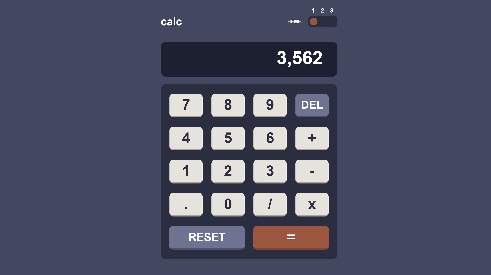
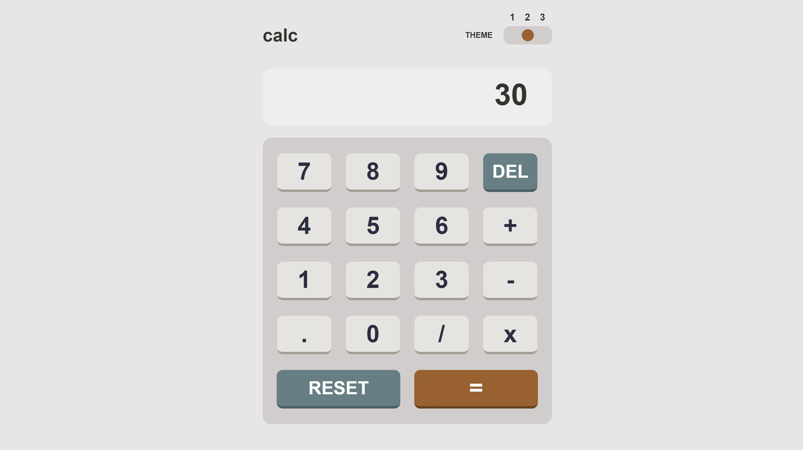
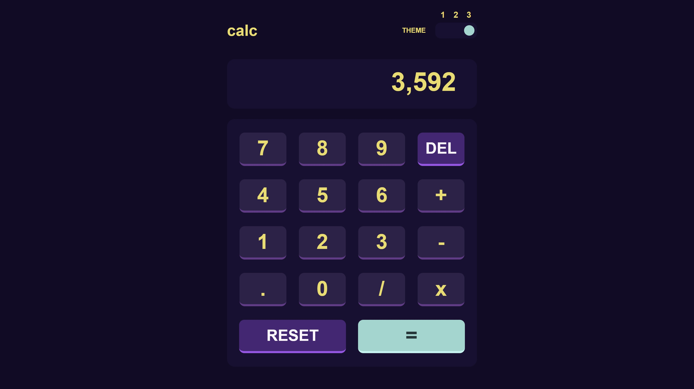

# Frontend Mentor - Calculator app solution

This is a solution to the [Calculator app challenge on Frontend Mentor](https://www.frontendmentor.io/challenges/calculator-app-9lteq5N29). Frontend Mentor challenges help you improve your coding skills by building realistic projects. 

## Table of contents

- [Overview](#overview)
  - [The challenge](#the-challenge)
  - [Screenshot](#screenshot)
  - [Links](#links)
- [My process](#my-process)
  - [Built with](#built-with)
  - [What I learned](#what-i-learned)
  - [Continued development](#continued-development)
- [Author](#author)


## Overview

### The challenge

Users should be able to:

- See the size of the elements adjust based on their device's screen size
- Perform mathmatical operations like addition, subtraction, multiplication, and division
- Adjust the color theme based on their preference

### Screenshot





### Links

- Live Site URL: [Github](https://mkab2000.github.io/calculator/)

## My process

### Built with

- Semantic HTML5 markup
- CSS custom properties
- Flexbox

### What I learned

Use this section to recap over some of your major learnings while working through this project. Writing these out and providing code samples of areas you want to highlight is a great way to reinforce your own knowledge.

To see how you can add code snippets, see below:

```html
<h1>Some HTML code I'm proud of</h1>
```

Theme changes easily adjusted using variables
```css
body {
  --background: #404762;
  --display: #1b1f31;
  --button-background: #282d42;
  --button: #e7e3dc;
}
body.light {
  --background: #e6e6e6;
  --display: #eeeeee;
  --button-background: #d1cdcd;
  --button: #e5e4e1;
}
body.neon {
  --background: #140928;
  --display: #1a0d33;
  --button-background: #1a0d33;
  --button: #2f1f4a;
}
```
```js
function changeTheme1() {
    hideButtons(this);
    const myBody = document.getElementsByTagName('body')[0];
    myBody.classList.remove('neon');
    myBody.classList.add('light');
  }
  
  function changeTheme2() {
    hideButtons(this);
    const myBody = document.getElementsByTagName('body')[0];
    myBody.classList.remove('light');
    myBody.classList.add('neon');
  }
  
  function changeTheme0() {
    hideButtons(this);
    const myBody = document.getElementsByTagName('body')[0];
    myBody.classList.remove('light');
    myBody.classList.remove('neon');
  }
```

### Continued development

The project is unfinished as of yet, some minor bugs and the lack of period functionality.
Will likely rewrite calculator functionality from scratch.


## Author

- Website - [miraskab](https://github.com/mkab2000)
- Frontend Mentor - [@miraskab](https://www.frontendmentor.io/profile/miraskab)
